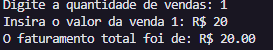
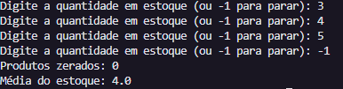
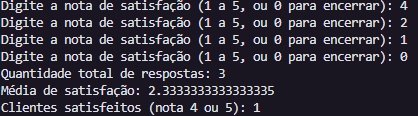
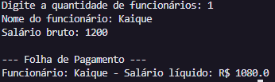

# Exercício – Folha de Pagamento

Este programa em Python calcula a folha de pagamento de uma empresa, aplicando desconto de INSS sobre o salário dos funcionários.

---

## 📘 Descrição do Programa

1. O usuário informa a **quantidade de funcionários**.  
2. Para cada funcionário, o sistema pede:  
   - Nome  
   - Salário bruto  
3. O programa calcula o **desconto de 10% de INSS**.  
4. Armazena os dados em **listas**.  
5. Ao final, exibe a folha de pagamento com o **nome** e o **salário líquido** de cada funcionário.

---

## ▶️ Como executar

1. Clone este repositório:
   ```bash
   git clone https://github.com/SEU-USUARIO/NOME-DO-REPO.git




